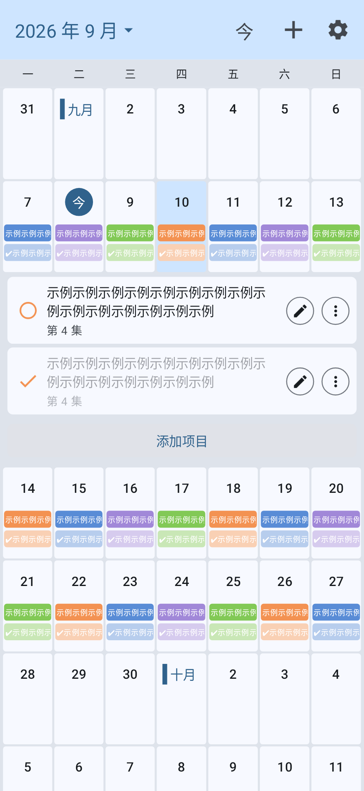
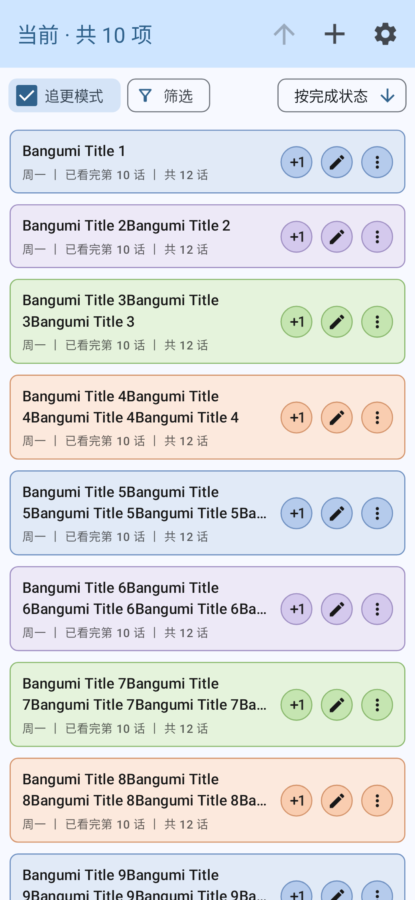
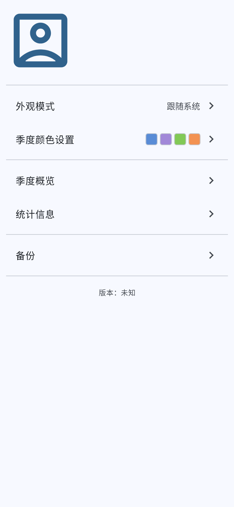
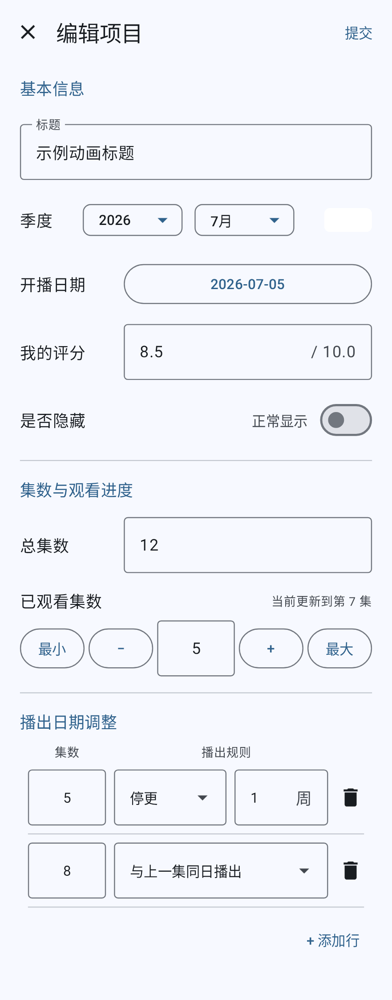
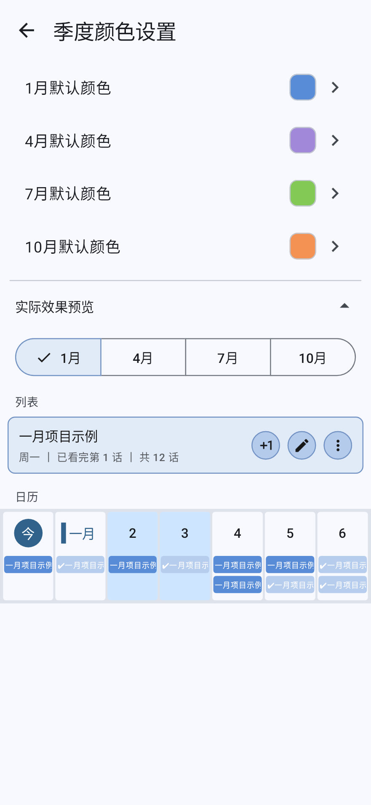
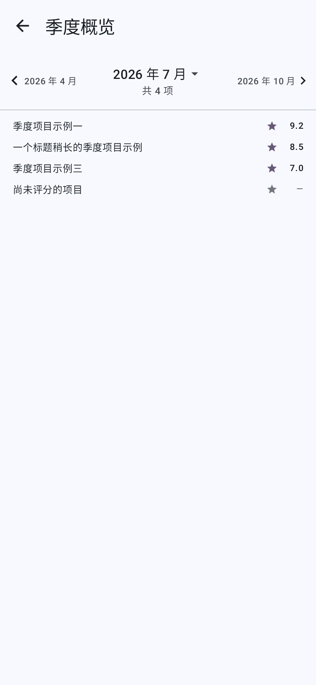
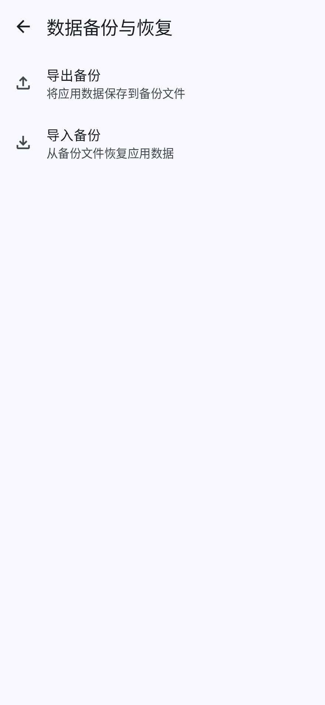

# 追更助手 Bangumi Manager Reformed

一款使用 Jetpack Compose 编写的 Android 番剧进度管理应用。它围绕番剧季度、播出日期和观看进度组织本地数据，并提供日历、项目列表、季度概览以及备份恢复等功能。

当前版本：`0.5.0-beta01`

[下载最新版本](https://github.com/9029Copy/Bangumi_Manager_Reformed/releases) · [查看更新日志](CHANGELOG.md)

> 项目目前处于 Beta 阶段，部分界面和功能仍在持续调整。

<p align="center">
  
  
  
</p>

## 主要功能

### 播出日历

- 按周查看番剧播出安排，并快速定位今天或指定日期。
- 查看选中日期下的项目与分集信息。
- 直接调整观看集数、隐藏状态，或进入项目编辑页面。
- 自定义日历前后显示周数、初始位置以及已完成内容的显示方式。
- 根据季度为项目应用不同的主题颜色。

<p align="center">
  
</p>

### 项目管理

- 通过 Index 页面集中浏览所有项目。
- 按季度、观看状态和隐藏状态筛选项目。
- 支持列表排序、回到顶部以及可拖动滚动条。
- 支持单项添加、批量添加、编辑和删除。
- 记录标题、季度、首播日期、总集数、观看进度和个人评分。

<p align="center">
  
</p>

### 播出规则

- 默认按照每周一集推算播出日期。
- 可为指定集数设置“停更若干周”。
- 可将指定集数设置为“与上一集同日播出”。
- 根据首播日期与规则生成 Schedule，并据此计算预计完结日期和日历分布。

<p align="center">
  
</p>

### 个性化与季度概览

- 支持浅色、深色和跟随系统三种外观模式；深色模式仍在继续完善。
- 分别设置一月、四月、七月和十月季度的默认颜色。
- 在颜色设置页面预览颜色应用到 Index 和 Calendar 后的效果。
- 按季度查看项目标题与个人评分，并快速切换目标季度。
- 季度选择清单会显示每个季度的项目数量，并标记离今天最近的季度。

<p align="center">
  
  
</p>

### 数据备份

- 将番剧、Schedule、日历设置和全局设置导出为 `.bmbackup` 文件。
- 从备份文件恢复全部数据，并在写入前进行格式和关联关系校验。
- 当前备份格式为版本 2，同时支持导入版本 1。
- 导入会替换应用中的现有数据，请在确认内容后操作。

备份文件的字段定义与兼容策略参见 [备份格式文档](docs/backup-format.md)。

<p align="center">
  
</p>

## 本地优先

应用数据保存在设备本地：

- 番剧及 Schedule 使用 Room 数据库保存。
- 日历和全局外观设置使用 Preferences DataStore 保存。
- 应用当前未启用网络权限，不依赖在线账户或远端服务。
- 数据迁移通过 Room Migration 完成，应用升级时会保留兼容版本的数据。

重要数据仍建议定期导出备份，并将备份文件保存在应用外部的可靠位置。

## 技术栈

- Kotlin
- Jetpack Compose
- Material Design 3
- Navigation Compose
- Room
- Preferences DataStore
- Hilt
- Kotlin Coroutines 与 Flow
- KSP
- [skydoves/colorpicker-compose](https://github.com/skydoves/colorpicker-compose)
- [nanihadesuka/LazyColumnScrollbar](https://github.com/nanihadesuka/LazyColumnScrollbar)

## 运行环境

- Android 8.0（API 26）及以上
- compileSdk / targetSdk：36
- Java 17
- Android Studio 与 Android SDK

## 获取与构建

克隆仓库：

```shell
git clone https://github.com/9029Copy/Bangumi_Manager_Reformed.git
cd Bangumi_Manager_Reformed
```

使用 Android Studio 打开项目并完成 Gradle Sync，然后选择设备运行 `app` 配置。

也可以在 Windows PowerShell 中构建 Debug APK：

```powershell
.\gradlew.bat assembleDebug
```

构建结果通常位于：

```text
app/build/outputs/apk/debug/
```

Release APK 的签名与发布应通过 Android Studio 的 **Generate Signed App Bundle or APK** 流程完成。`app/release/` 是本地构建产物目录，不会提交到 Git。

## 项目结构

```text
app/src/main/java/com/copy9029/bangumimanagerreformed/
├── data/                   # Room、DataStore、Repository 与数据模型
│   ├── backup/            # 备份模型、JSON 编解码、校验和读写
│   └── migration/         # Room 数据库迁移
├── navigation/             # 页面路由与导航容器
├── ui/
│   ├── bangumi/           # 项目详情、添加与编辑
│   ├── calendar/          # 日历及日历设置
│   ├── components/        # 通用 Compose 组件
│   ├── index/             # 项目列表、筛选与排序
│   ├── profile/           # 个人、颜色、概览、统计与备份页面
│   └── theme/             # 应用及项目主题配色
└── util/                   # 季度与 Schedule 等通用计算
```

Room 导出的 Schema 位于 `app/schemas/`，用于记录数据库结构版本并辅助验证 Migration。

## 当前状态

- 当前为 Beta 版本，核心的项目管理、日历、播出规则和本地备份流程已经可用。
- 统计信息页面仍在规划和开发中。
- 深色模式及部分视觉细节及仍将继续优化。
- 即将完善项目的批量编辑功能、更多个性化选项以及安卓官方备份的兼容化。
- 版本变化请查看 [CHANGELOG.md](CHANGELOG.md)。

## 致谢与第三方代码

本项目使用并感谢以下开源项目与代码作者。第三方代码仍遵循各自的许可证，其版权不因被本项目引用或修改而发生变化。

### 基于源码修改的组件

- [compose-wheel-picker](https://github.com/zj565061763/compose-wheel-picker)：`ui/components/wheel_picker` 中的滚轮选择组件基于该项目源码修改，用于日期选择器中的年份和月份选择。原项目采用 [MIT License](https://github.com/zj565061763/compose-wheel-picker/blob/master/LICENSE)。
- [re-ovo DatePicker](https://gist.github.com/re-ovo/2b4cc2c4fdfb03784fa8643dd360f4a5)：`AppDatePicker` 的初始实现参考并修改自该 Gist，用于提供以周一为每周起始日的日期选择界面。该 Gist 页面未明确附带开源许可证，相关代码的使用与再发布授权以原作者说明为准。

### 外部依赖

- [skydoves/colorpicker-compose](https://github.com/skydoves/colorpicker-compose)：当前使用版本 `1.1.2`，用于 HSV 颜色选择以及亮度、透明度调节。原项目采用 [Apache License 2.0](https://github.com/skydoves/colorpicker-compose/blob/main/LICENSE)。
- [nanihadesuka/LazyColumnScrollbar](https://github.com/nanihadesuka/LazyColumnScrollbar)：当前使用版本 `2.2.0`，用于 Index 和季度概览列表的滚动位置显示与拖动。原项目采用 [MIT License](https://github.com/nanihadesuka/LazyColumnScrollbar/blob/master/LICENSE)。

直接纳入项目的第三方源码保留了相应的来源与许可证注释。发布或再分发本项目时，也应一并保留相关版权及许可证声明。

完整的第三方组件来源、使用方式和许可证副本参见 [THIRD_PARTY_NOTICES.md](THIRD_PARTY_NOTICES.md)。

## 许可证

本项目原创部分采用 [MIT License](LICENSE) 开源。第三方代码与依赖不因此变更许可证，仍分别遵循 [第三方声明](THIRD_PARTY_NOTICES.md) 中列出的许可条款。
